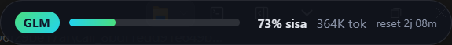
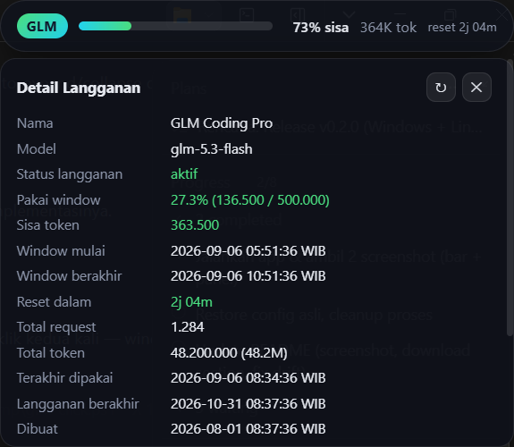

# glm-overflow

Bar stat pemakaian langganan GLM coding plan — pill overlay kecil yang selalu tampil
di kanan-atas layar (always-on-top, tanpa taskbar) + tray icon. **Multi-provider**:
pakai proxy glmprox atau langsung ke API Z.ai. Dibangun dengan
**Tauri 2** (Rust backend, UI vanilla TS/CSS, binary ringan).

## Download

Ambil installer dari [**Releases**](https://github.com/imhcode/glm-prox-monitor/releases/latest):

| Platform | File |
| --- | --- |
| Windows | `glm-overflow_0.3.0_x64-setup.exe` (NSIS, instalasi per-user) |
| Linux (Debian/Ubuntu) | `glm-overflow_0.3.0_amd64.deb` |
| Linux (universal) | `glm-overflow_0.3.0_amd64.AppImage` |

> Installer belum di-code-sign → SmartScreen/antivirus bisa menampilkan peringatan
> pertama kali dijalankan. Data pada screenshot di bawah adalah data dummy.

## Screenshot

**Pill bar** — selalu tampil di kanan-atas layar:



**Panel detail** — klik pill untuk melihat rincian langganan:



## Fitur

- **Multi-provider**: pilih vendor di Settings atau tray —
  [glmprox](docs/providers/glmprox.md) (proxy GLM, default) atau
  [Z.ai langsung](docs/providers/zai.md) (API key, tanpa proxy).
- **Pill bar**: progress pemakaian window 5 jam, **% sisa**, **sisa token**, dan countdown reset.
  - hijau (aman) → amber (<20% sisa) → merah (<5% sisa / kena limit)
- **Panel detail** (klik pill): rincian langganan per provider — nama, model/plan,
  meter sesi & mingguan (Z.ai), sisa token, window mulai/berakhir, total
  request/token, last used, expiry langganan, key — semua waktu ditampilkan **WIB**.
- **Tray icon**: tooltip berisi ringkasan; klik kiri toggle bar; menu Show/Hide · Refresh Now ·
  Provider · Theme · Settings · Quit.
- **Settings** (di panel): provider, kredensial per-provider, interval refresh (10–3600 detik).
- **State otomatis**: rate-limited (hitung mundur dari `error.window_ends_at`), offline
  (retry tiap interval).
- Konfigurasi tersimpan di:
  - Windows: `%APPDATA%\glm-overflow\config.json`
  - Linux: `~/.config/glm-overflow/config.json`

## Linux & always-on-top

Agar pill selalu tampil di atas window lain (fitur utama app ini), glm-overflow
menangani Linux secara khusus:

- **Sesi X11** (default di kebanyakan distro): app memanggil ulang `keep-above`
  secara otomatis — saat startup (beberapa retry setelah window di-map), saat
  show/hide dari tray, saat panel di-expand, saat fokus berubah, setelah drag
  selesai, plus watchdog tiap 20 detik. Sebagian window manager memang mengabaikan
  atau menjatuhkan state keep-above, dan ini menutup celah tersebut.
- **Sesi Wayland** (GNOME/KDE Wayland): protokol Wayland **tidak punya** mekanisme
  keep-above untuk window biasa, jadi app otomatis berjalan lewat **XWayland**
  (`GDK_BACKEND=x11`) agar keep-above tetap dihormati window manager.
  Efek samping: pada skala fraksional (125%/150%) teks bisa sedikit kurang tajam
  dibanding Wayland native.
  - Opt-out (paksa Wayland native): `GLM_OVERFLOW_ALLOW_WAYLAND=1 glm-overflow`
    — tapi native Wayland umumnya **tidak bisa** always-on-top. Alternatif di KDE:
    pasang Window Rule *Keep above* untuk window `glm-overflow`.

## Provider

glm-overflow mendukung beberapa sumber data usage; pilih lewat Settings atau tray
(submenu *Provider*):

| Provider | Kredensial | Sumber data | Dokumen |
| --- | --- | --- | --- |
| **glmprox** (default) | Token proxy + base URL | `GET {base_url}/stats` milik [glm-prox-monitor](https://github.com/imhcode/glm-prox-monitor) | [docs/providers/glmprox.md](docs/providers/glmprox.md) |
| **Z.ai** | API key Z.ai | `api.z.ai` — meter sesi 5 jam, mingguan, web search | [docs/providers/zai.md](docs/providers/zai.md) |

Detail kredensial, endpoint, dan arti tiap state error ada di dokumen masing-masing
provider. Menambah vendor baru cukup dengan satu modul di
`src-tauri/src/providers/` (pola `ProviderRuntime` ala [openusage](https://github.com/robinebers/openusage)).

## Development

Prasyarat: Node 18+, Rust (rustup), dan:

- **Windows**: MSVC Build Tools dengan workload C++ (`Microsoft.VisualStudio.Workload.VCTools`)
  + WebView2 runtime (sudah bawaan Win10/11).
- **Linux**: `sudo apt install libwebkit2gtk-4.1-dev build-essential curl wget file libxdo-dev libssl-dev libayatana-appindicator3-dev librsvg2-dev`

```bash
npm install
npm run tauri dev      # mode development (hot reload)
npm run tauri build    # produksi + installer
```

Hasil build:

- Windows: `src-tauri/target/release/bundle/nsis/glm-overflow_0.3.0_x64-setup.exe`
- Linux: `bundle/deb/*.deb` dan `bundle/appimage/*.AppImage`

## Release CI

Push tag `v*` (mis. `git tag v0.2.1 && git push origin v0.2.1`) → GitHub Actions
(`.github/workflows/release.yml`) membangun installer Windows + Linux dan
mem-publish-nya langsung sebagai GitHub Release (lengkap dengan release notes
otomatis).

## Catatan keamanan

- **Kredensial tidak pernah disimpan di source code.** Set token/API key lewat
  **Settings** di app (tersimpan di `config.json` lokal, di luar repo) atau env
  (`GLM_OVERFLOW_TOKEN` untuk glmprox, `ZAI_API_KEY` untuk Z.ai) sebelum first-run.
  Tanpa kredensial, app tetap jalan dengan state offline.
- Installer belum di-code-sign → SmartScreen/antivirus bisa menampilkan peringatan
  pertama kali dijalankan.
